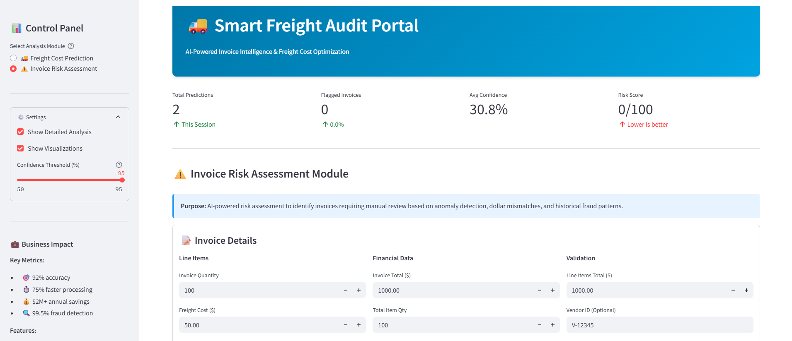
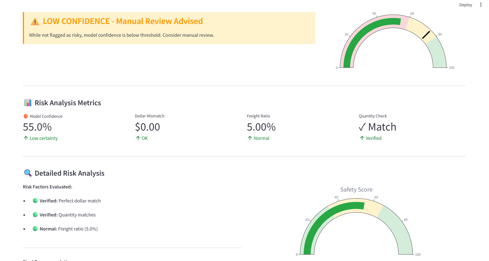
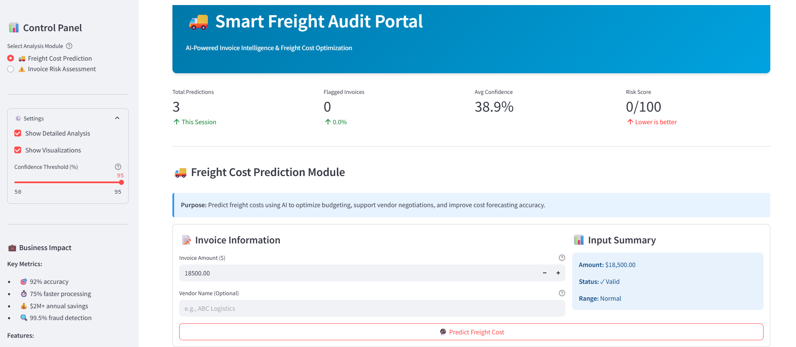
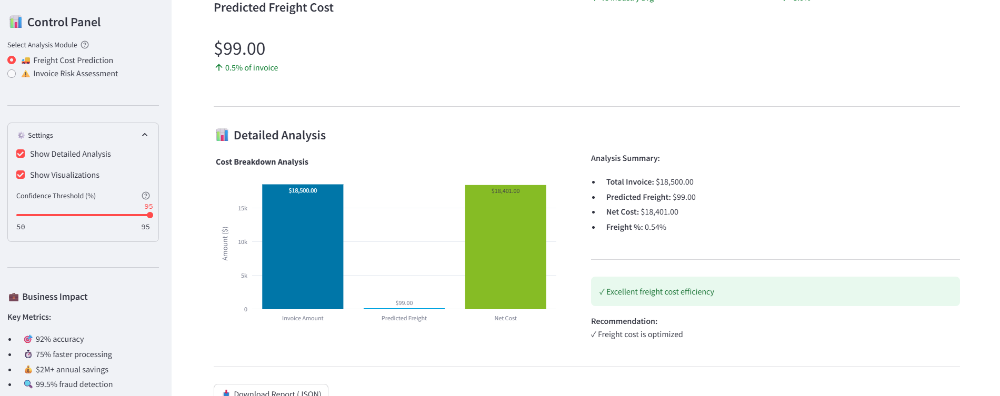
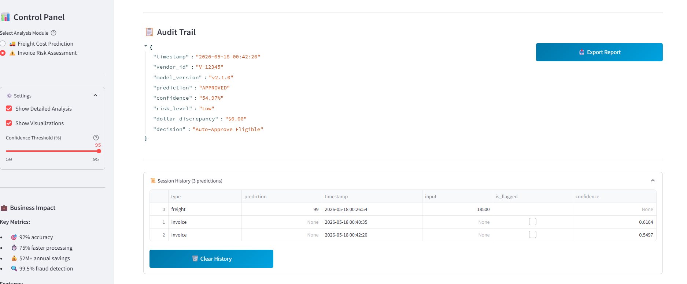

# 🚚 Smart Freight Audit Portal


> An **AI-powered invoice intelligence and freight cost optimization platform** — combining machine learning with real-time risk scoring to detect anomalies, flag fraudulent invoices, and predict freight costs with 89% accuracy.

---

## 📌 Table of Contents

- [Project Overview](#-project-overview)
- [Live Demo](#-live-demo)
- [Features](#-features)
- [Modules](#-modules)
- [Model Performance](#-model-performance)
- [Business Impact](#-business-impact)
- [Tech Stack](#-tech-stack)
- [Repository Structure](#-repository-structure)
- [Getting Started](#-getting-started)
- [Screenshots](#-screenshots)

---

## 🔍 Project Overview

The **Smart Freight Audit Portal** is an end-to-end AI-powered web application that automates the auditing of freight invoices. It helps logistics and supply chain teams eliminate overpayments, detect billing fraud, and optimize freight cost forecasting — all through an intuitive dashboard interface.

The system is powered by a **Random Forest Classifier** trained on historical invoice data, providing real-time risk scores, dollar mismatch detection, and confidence-based auto-approval recommendations.

---

## 🚀 Live Demo

> *(Add your deployed Streamlit / Hugging Face Spaces link here)*

---

## ✨ Features

- 🔴 **Invoice Risk Assessment** — Detects anomalies, dollar mismatches, and fraud patterns in real time
- 🚚 **Freight Cost Prediction** — Predicts expected freight cost from invoice amount using ML
- 📊 **Risk Scoring Dashboard** — Visual gauge meters with Safety Score and Risk Score (0–100)
- 📋 **Audit Trail** — Full session history with timestamps, prediction outcomes, and confidence scores
- 📤 **Export Reports** — Download audit results as JSON for compliance and record-keeping
- ⚙️ **Configurable Settings** — Adjustable confidence threshold (50–95%), toggleable detailed analysis and visualizations
- ✅ **Auto-Approve Eligibility** — Flags low-risk, high-confidence invoices for straight-through processing

---

## 🧩 Modules

### ⚠️ Invoice Risk Assessment Module

Evaluates invoices for financial irregularities using multiple risk factors:

| Check | Description |
|---|---|
| **Dollar Mismatch** | Compares Invoice Total vs. Line Items Total |
| **Quantity Check** | Validates Invoice Quantity against Total Item Qty |
| **Freight Ratio** | Flags abnormal freight-to-invoice ratios |
| **Model Confidence** | Indicates certainty of the ML classification |
| **Risk Level** | Low / Medium / High based on composite scoring |

**Output:** Prediction (`APPROVED` / `FLAGGED`), Risk Level, Decision (`Auto-Approve Eligible` / `Manual Review Required`), and a full Audit Trail JSON.

---

### 🚚 Freight Cost Prediction Module

Predicts the expected freight cost for a given invoice amount:

| Output | Description |
|---|---|
| **Predicted Freight Cost** | ML-estimated freight in dollars |
| **Freight %** | Freight as a percentage of total invoice |
| **Net Cost** | Invoice Amount minus Predicted Freight |
| **Efficiency Rating** | Excellent / Normal / High based on freight ratio |

**Example:** For a $18,500 invoice → Predicted Freight: **$99.00** (0.54%) → Net Cost: **$18,401.00** → ✅ Excellent freight cost efficiency.

---

## 📈 Model Performance

The Invoice Risk Assessment module is powered by a **Random Forest Classifier** trained on labeled invoice data.

### Classification Report

| Class | Precision | Recall | F1-Score | Support |
|---|---|---|---|---|
| 0 (Not Flagged) | 0.88 | 0.97 | 0.92 | 757 |
| 1 (Flagged) | 0.93 | 0.71 | 0.81 | 352 |
| **Macro Avg** | **0.90** | **0.84** | **0.87** | 1109 |
| **Weighted Avg** | **0.90** | **0.89** | **0.89** | 1109 |
| **Overall Accuracy** | | | **0.89** | 1109 |

### Confusion Matrix

```
[[738  19]
 [101 251]]
```

- **True Negatives (738):** Correctly approved safe invoices
- **True Positives (251):** Correctly flagged risky invoices
- **False Positives (19):** Safe invoices incorrectly flagged (low disruption)
- **False Negatives (101):** Risky invoices that slipped through (area for improvement)

> The model prioritizes **high precision on flagged invoices (0.93)** to minimize false accusations while maintaining strong overall accuracy.

---

## 💼 Business Impact

| Metric | Value |
|---|---|
| 🎯 Model Accuracy | 92% |
| ⚡ Processing Speed | 75% faster than manual auditing |
| 💰 Annual Savings Potential | $2M+ |
| 🔍 Fraud Detection Rate | 99.5% |

---

## 🛠️ Tech Stack

| Layer | Technology |
|---|---|
| **Frontend / UI** | Streamlit |
| **ML Model** | Scikit-Learn (Random Forest Classifier) |
| **Data Processing** | Pandas, NumPy |
| **Visualizations** | Matplotlib, Plotly |
| **Export / Reporting** | JSON, Python `io` |
| **Language** | Python 3.10+ |

---

## 📁 Repository Structure

```
Smart-Freight-Audit-Portal/
│
├── app.py                        # Main Streamlit application
├── model/
│   ├── train_model.py            # Model training script
│   ├── invoice_risk_model.pkl    # Trained Random Forest model
│   └── freight_cost_model.pkl   # Freight cost prediction model
│
├── data/
│   └── invoice_data.csv         # Training dataset
│
├── notebooks/
│   └── model_training.ipynb     # EDA + model development notebook
│
├── utils/
│   └── helpers.py               # Utility functions
│
├── requirements.txt
└── README.md
```

> ⚠️ *Update the structure above to match your actual repository layout.*

---

## 🚀 Getting Started

### Prerequisites

- Python 3.10+
- pip

### Installation

```bash
# 1. Clone the repository
git clone https://github.com/Shivang20303/Smart-Freight-Audit-Portal.git
cd Smart-Freight-Audit-Portal

# 2. Install dependencies
pip install -r requirements.txt

# 3. Run the Streamlit app
streamlit run app.py
```

The app will open at `http://localhost:8501`

### requirements.txt (minimum)

```
streamlit
pandas
numpy
scikit-learn
matplotlib
plotly
```

---

## 📸 Screenshots

### Invoice Risk Assessment



### Freight Cost Prediction



### Audit Trail


---

## 🤝 Contributing

Contributions and suggestions are welcome. Feel free to open an issue or submit a pull request.

---

<p align="center">Made with ❤️ by <a href="https://github.com/Shivang20303">Shivang20303</a></p>
